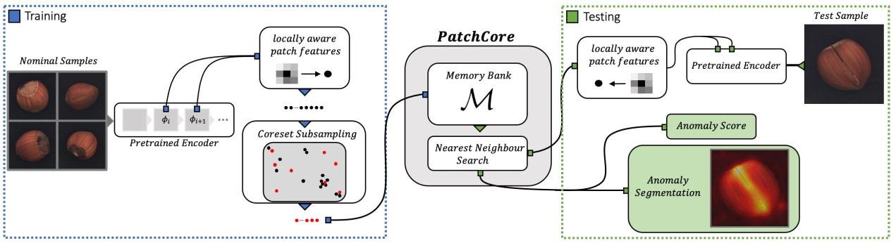

# PatchCore anomaly detection
Unofficial implementation of PatchCore anomaly detection model for AML PoliTo Course

Original Paper : 
Towards Total Recall in Industrial Anomaly Detection (Jun 2021)  
Karsten Roth, Latha Pemula, Joaquin Zepeda, Bernhard Schölkopf, Thomas Brox, Peter Gehler  

https://arxiv.org/abs/2106.08265  
https://paperswithcode.com/sota/anomaly-detection-on-mvtec-ad

